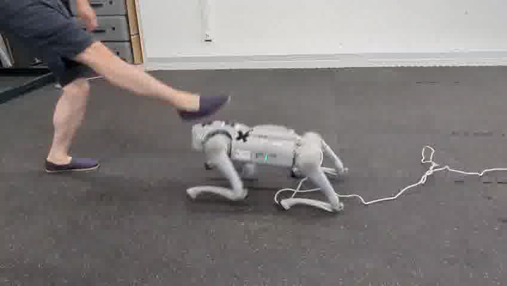
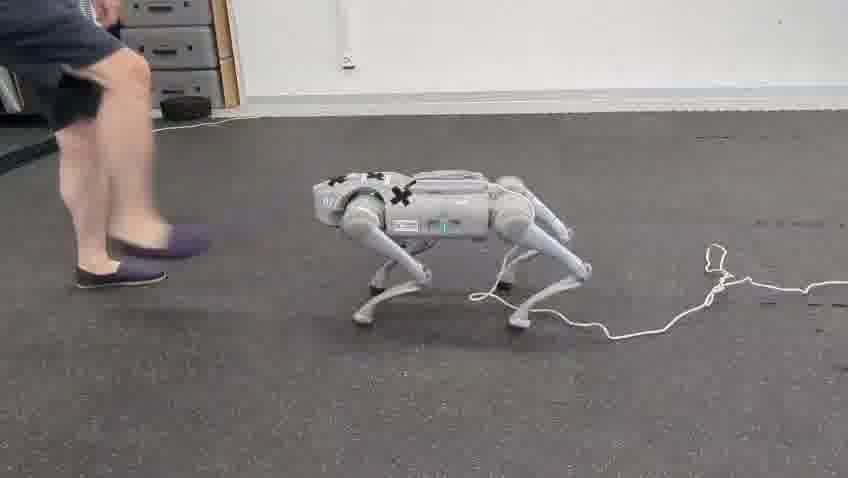
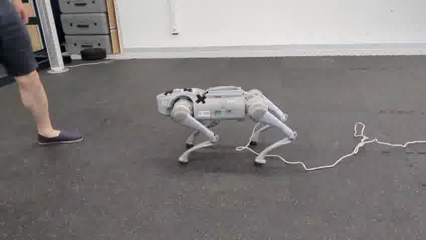

<p align="center">
  
  
  
  
</p>


# Safe Sim2Real
A collection of algorithms and experiment tools for safe sim to real transfer in robotics.

## Features
* Three different CMDP solvers, [CRPO](https://arxiv.org/abs/2011.05869), [Saute-RL](https://arxiv.org/abs/2202.06558) and primal-dual, compatible with (variants of) [Brax's](https://github.com/google/brax) SAC, MBPO and PPO.
* Algorithm implementation is interchangeable between training in simulation to training on real robots via [OnlineEpisodeOrchestrator](https://github.com/yardenas/safe-sim2real/blob/b1962ac5e453b172eaa8373f8d382b562cf5a03b/ss2r/rl/online.py#L19C7-L19C32). Check out `rccar_experiments` for a full example. Support for training online on any real robot supported by [MuJoCo Playground](https://github.com/google-deepmind/mujoco_playground), including Unitree Go1/2.
* Blazing fast training. Full compatibility with [MuJoCo Playground](https://github.com/google-deepmind/mujoco_playground). Reimplementation of OpenAI's [Safety Gym](https://github.com/openai/safety-gym) in MJX and safety tasks from [Real-World RL suite](https://github.com/google-research/realworldrl_suite/tree/master).


## Requirements

- Python == 3.11.6
- `venv` or `Poetry`

## Installation

### Using pip

```bash
git clone https://github.com/yardenas/safe-sim2real
cd safe-sim2real
python3 -m venv venv
source venv/bin/activate
pip install -e .
````

### Using Poetry

```bash
git clone https://github.com/yardenas/safe-sim2real
cd safe-sim2real
poetry install
poetry shell
```

## Usage

Our code uses [Hydra](https://hydra.cc/) to configure experiments. Each experiment is defined as a `yaml` file in `ss2r/configs/experiments`. For example, to train a Unitree Go1 policy with a constraint on joint limit:

```bash
python train_brax.py +experiment=go1_sim_to_real
```
## Docs
* Policies (in `onnx` format) used for the Unitree Go1 experiments can be found in `ss2r/docs/policies`.
* In `ss2r/docs/videos` you can find videos of 5 trials for each policy, marked by its policy id.


<!-- ## Citation

If you find our repository useful in your work, please consider citing:

```bibtex
``` -->

<!-- ## Learn More

* **Project Webpage**: 
* **Paper**:
* **Contact**: 

